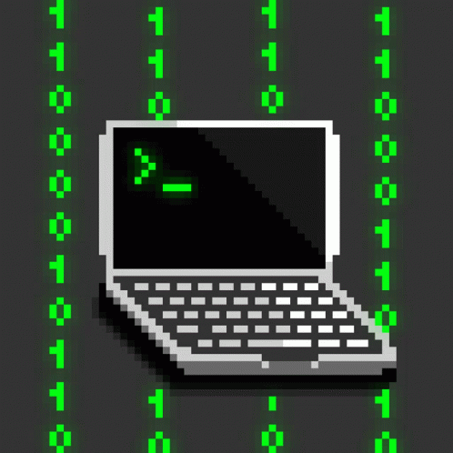

<div align="center">

<!-- HERO DASHBOARD BANNER - profile.sh --live -->


<br/>

<!-- ANIMATED TERMINAL TYPING GREETING -->
<a href="https://github.com/x-adityachauhan">
  
</a>

<br/>

<!-- SOCIALS & QUICK CONNECT -->
<a href="https://www.linkedin.com/in/aditya-chauhan-137890363/"></a>&nbsp;&nbsp;
<a href="mailto:adityachauhan25881@gmail.com"></a>&nbsp;&nbsp;
<a href="https://github.com/x-adityachauhan"></a>

</div>

---

### 💻 `system.log --about`

```text
================================== [ USER TELEMETRY ] ==================================
• IDENTITY   : Aditya Chauhan | Full-Stack Developer · AI & Cybersecurity Explorer
• FOCUS      : Full-Stack Engineering, Applied AI, and Cybersecurity / CTFs
• PHILOSOPHY : Learning by building — turning theoretical concepts into shipped code
• CURRENT    : Exploring scalable web architectures, reverse engineering, and AI models
• STATUS     : Open to collaboration on beginner-friendly & high-impact open-source tools
========================================================================================
```

---

### 🛡️ `ctf.sh --cybersecurity`

<table>
<tr>
<td width="30%" align="center" valign="middle">



<br/>
<sub><code>OPERATOR // CTF MODE</code></sub>

</td>
<td width="70%" valign="middle">

#### Core Cyber & CTF Focus Areas
- 🔍 **Web Application Security** — Vulnerability analysis, OWASP Top 10, auth bypass testing
- 🧩 **Cryptography & Encoding** — Cipher cracking, hashing algorithms, and protocol security
- 🕵️ **Digital Forensics & OSINT** — Packet analysis, memory dumps, and artifact inspection
- ⚙️ **Reverse Engineering** — Binary inspection, decompilation, and flow analysis

</td>
</tr>
</table>

---

### 🧰 `toolchain.cfg --skills`

<table>
<tr>
<td width="70%" valign="middle">

<div align="center">


</div>

</td>
<td width="30%" align="center" valign="middle">


<br/>
<sub><code>BUILD // SHIP // REPEAT</code></sub>

</td>
</tr>
</table>

---

### 📡 `pipeline.status --focus`

<table align="center" width="100%">
<tr>
<td valign="top" width="33%">

#### 🌐 Frontend & UI
- React / Next.js
- TypeScript / JavaScript
- Modern Vanilla CSS & Tailwind
- Responsive Layouts & UX

</td>
<td valign="top" width="33%">

#### ⚙️ Backend & Systems
- Python & Node.js
- C++ (DSA & Fundamentals)
- RESTful APIs & Data Flow
- Linux Environments

</td>
<td valign="top" width="33%">

#### 🛠️ Dev Tools & Infra
- Git & GitHub Actions
- Figma Design & UI Prototyping
- Vercel Deployment
- VS Code & Windows Terminal

</td>
</tr>
</table>

---

### 📊 `telemetry.sh --activity`

<div align="center">

<p align="center">
  
  
</p>

<p align="center">
  
</p>

</div>

---

<div align="center">


<br/>

<sub><code>profile.sh --live · UTC+5:30 · IN NODE · ALL SYSTEMS NOMINAL</code></sub>

</div>

